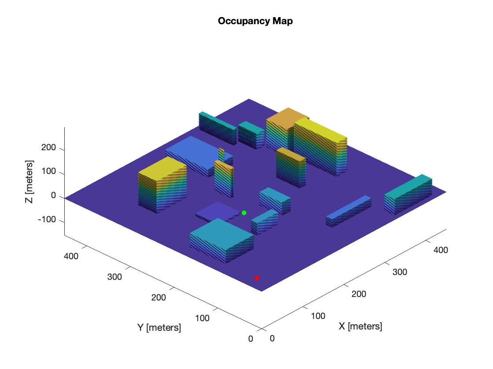

# Fixed Wing Unmanned Aerial Vehicle Motion Planning
Motion Planning example using Rapidly Exploring Random Trees in MATLAB/Simulink for a fixed-wing unmanned aerial vehicle.

# Occupancy Map

  

3D Occupancy Map which contains a set of pregenerated obstacles(15).
